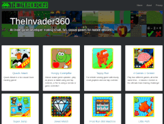
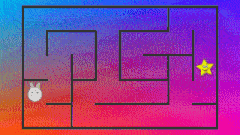
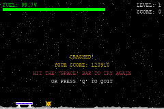
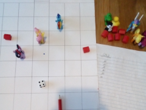
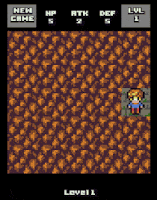
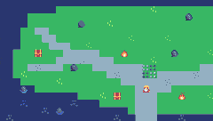

I've neglected this little corner of the web for nearly three years, shame on me!

A lot has happened in that time. I was promoted at work (Yay!)... Then I was made redundant when the company folded (Boo? Hiss? Maybe, maybe not, I'm undecided...). Our children celebrated some birthdays - our eldest is now 6, and our youngest is 3. I suppose we got a little older too, but the less said about that the better! I've taken care of some real world projects - mostly satisfying physical work involving wood and concrete and hand tools and sweat. Oh yeah, and the whole goddamn world has been turned upside down thanks to a global pandemic. Fun times!

When I've not been homeschooling the girls, hiking in the amazing countryside that is rather conveniently situated right at my doorstep, completing practical projects around the house, *reading all the things*, and vegetating in front of netflix, I have been pratting around with my fingers on a keyboard tinkering with various software projects.

Absolute emphasis on ***TINKERING***.

There has been little in the way of reasoning behind what I've been messing with other than "I am currently the master of my own destiny, I have some technology on hand, a brain that needs exercise, and although the libraries are sadly shut we do have an amazing resource called t'interwebs on hand these days, so why not just have some fun". Sure, keeping my brain active and tinkering with Java/Go/JavaScript might have some practical benefits when it's time to find a new job, but that's as far as it goes. My mindset is firmly back to that of my 10 year old self, hacking away on a ZX Spectrum programming Sinclair Basic just for fun 😃

So, what software projects have I been fiddling with, you might ask... Well, there are a great many, but here's the top ten (ok, ok, it's less a top ten and more a list of things I've worked on most recently and/or not already forgotten about). In no particular order:

1. I started (well, nearly finished) working on my very own retro style minimal Simple RPG. I don't really know why I've not finished it if I'm honest. Developers and their goldfish-like attention spans eh? I'll probably blog about this project separately and add a link (or maybe forget to add a link) here when I do.

{ width="360" height="270" fit="inside" }

2. I rewrote [theinvader360.com](http://www.theinvader360.com) in Go. Almost entirely pointless, it could quite happily be a static site, but I wanted to so I did 🙂 Yes, you *will* see a pattern emerge in my justification of how I choose to spend my limited time on this planet...

[{ width="358" height="270" fit="inside" }](http://www.theinvader360.com)

3. I actually released something on [Google Play](https://play.google.com/store/apps/developer?id=TheInvader360)! Don't get too excited, it's just a [Maths Quiz](https://play.google.com/store/apps/details?id=com.theinvader360.quiz.maths) 😉 Our eldest loves a maths challenge, and she responds massively well to gamification - anything where she can score 10 out of 10 is a winner. This app was built with her firmly in mind, no countdown clocks or pressure to "guess" the answer, just a simple ten randomly generated questions and taking your sweet time to answer correctly kind of deal. She's consistently scoring 10/10 on each challenge type now, so maybe something with a bit of hazard/risk is called for next... Although it's a fairly boring "game" to look at, it was actually quite good fun to write. I might write more about it sometime, and maybe try to remember to link to it here...

[{ width="189" height="270" fit="inside" }](https://play.google.com/store/apps/details?id=com.theinvader360.quiz.maths)

4. I wrote a procedural maze generator and cobbled together a basic maze game. I never got round to polishing and releasing the app, but it's installed on the living room fire stick and the girls like playing it every now and then 🙂

{ width="360" height="203" fit="inside" }

5. I fiddled about with PyGame and built a Lunar Lander game. This project was kicked off at a local nerd club gathering back when such things were possible, great fun! Oh how I miss being quiet and antisocial in a room full of grown adults, it's just not the same being quiet and antisocial in the comfort of your own home.

{ width="360" height="240" fit="inside" }

6. My six year old and I collaborated on designing a rule set for a pen and paper tabletop game ([SiTTeRS](https://github.com/TheInvader360/SiTTeRS)). I had originally planned to turn this into an app, but figured we liked it as it was - a low tech, two players in the same room, real time, physical pen and paper and a dice kinda deal, so I dropped the computer simulation aspect and kept it strictly low tech.

[{ width="360" height="270" fit="inside" }](https://github.com/TheInvader360/SiTTeRS)

7. Nothing at all to do with games, but I wrote an extremely [minimal headless Go application](https://github.com/TheInvader360/checklist-backend-golang) fronted by an equally [minimal Vue.js frontend](https://github.com/TheInvader360/checklist-frontend-vuejs). Not particularly useful - you can achieve the end result as it stands in vue alone, but I liked getting the two parts to work together.

[{ width="360" height="264" fit="inside" }](https://github.com/TheInvader360/checklist-frontend-vuejs)

8. I built a very simple [Memory game](https://github.com/TheInvader360/simple-memory-game) using Go and the [Ebiten](https://ebiten.org/) library. I've built an executable to run on my laptop, and an apk to install on our various android touch screen devices. This isn't destined for proper app store release, but feel free to grab it from [GitHub](https://github.com/TheInvader360/simple-memory-game)!

[{ width="270" height="270" fit="inside" }](https://github.com/TheInvader360/simple-memory-game)

9. I started building a small Dungeon Sweeper game. No idea why I didn't finish this, I probably should at some point, the scope is super tiny compared to the Simple RPG mentioned up top. It would also make a nice little fantasy console game. I might come back to this at some point...

{ width="212" height="270" fit="inside" }

10. I read about the [Pico-8](https://www.lexaloffle.com/pico-8.php) a while ago and found the whole subject of fantasy consoles to be quite fascinating. I'd have killed for that kind of dev environment back in my Spectrum days! Then a couple of days ago I discovered the [TIC-80](https://tic.computer/)... It's free as in beer, free as in speech, and it supports JavaScript... Sold! I ported a [nice Pico-8 tutorial](https://www.youtube.com/watch?v=J1wvvbVQ5zo&list=PLdLmU93eWisKpyk1WZywUSYAq5dkCPFIv) to the TIC-80, and in a single day I had a crappy "game" that could be played on the living room TV using an Xbox One controller, and [via the web](https://theinvader360.github.io/explore-tic80-js/) using keyboard controls (cursor and "z" keys replacing the d-pad and "a" button). I can see myself spending a lot more time tinkering with these fantasy consoles 🙂

[{ width="360" height="204" fit="inside" }](https://github.com/TheInvader360/explore-tic80-js)

It strikes me that most of the projects I've enjoyed playing with recently have been quite small and short lived. I've aimed to spend only a day or two's worth of spare time on each, with the aim of getting something minimal and functional finished in that time. Pretty much the [Ludum Dare](https://ldjam.com/events/ludum-dare/rules) rules really. This has been the case with pretty much everything other than the unfinished simple RPG game (no matter how "simple", it's still nowhere near a weekend project!).

I have lots of ideas for future projects. I'd like to finish the Simple RPG and Dungeon Sweep games at some point. I might write a completely pointless static blog/CMS engine, just because (add it to the heap of others out there that nobody wants or needs) 😃 I'd like to write some Spectrum / NES / Game Boy ROMs (maybe some remakes or demakes). I'd also like to see if there's anything fun I can do with some of the old hardware we have lying around (Spectrum, Game Boy, DS, PS2, PSP, Wii, etc). I have a Raspberry Pi 3 that is pretty much a dedicated [RetroPie](https://retropie.org.uk/) machine - it gets played with more than the Xbox One, but maybe I should do more with it. If I'm feeling particularly masochistic I might spend some time on lower level stuff than I'm used to, maybe some assembly is in order 🙂 I'd also like to spend some more time playing with fantasy consoles like the TIC-80, just because it's fun...

Then there's the huge subject of moving on from teaching our children traditional languages, science, and maths, and sprinkling in a little bit of computer science. There will be some [Scratch](https://scratch.mit.edu/) and Python in my future for sure, and I can't imagine any better teaching method than making games. It's gonna be fun! 😃

So yeah, I'm still alive, I'm not really focused on publishing new games to [Google Play](https://play.google.com/store/apps/developer?id=TheInvader360) any more, but I do still love making and playing games and little educational doodads and thingermawotzits.

Until next time, au revoir!
